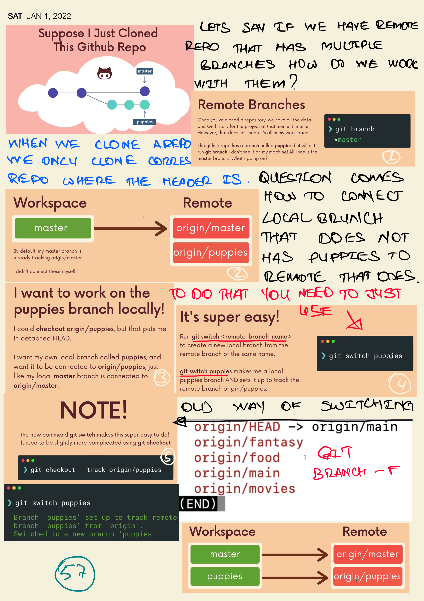
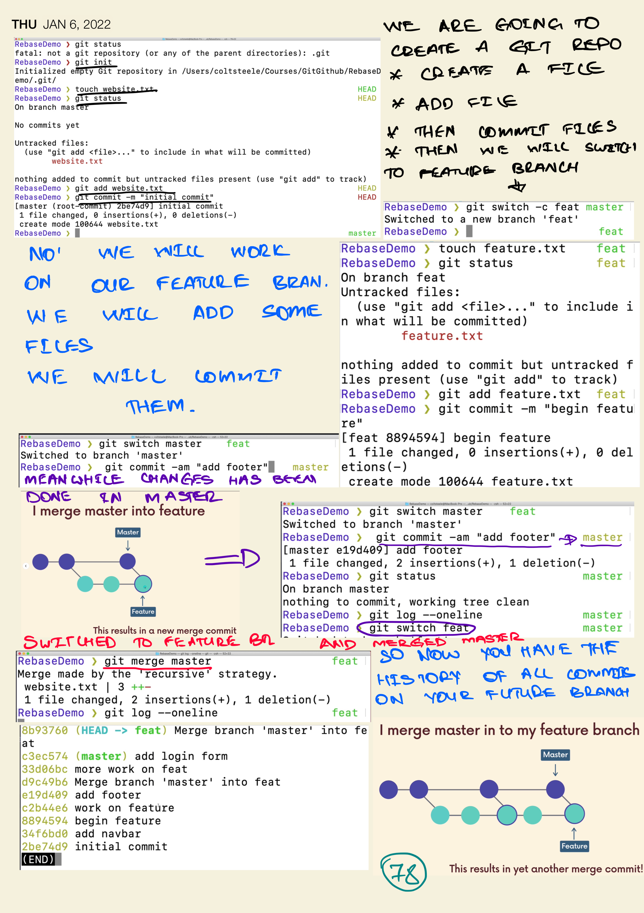

# GIT AND GITHUB COURSE
# GIT AND GITHUB COURSES
This is course is dedicated for the developers who wants to succeed or recall the knowledges
This is a git repo learning and course

# Git Config

# What is GitKraken

# What is Git Repository?

# Git Init

# Git Commit

# Git Commit Good Practice

# Git Configure Default Text Editor

# Git Log

# Git commit --amend

# Git Ignore

# Git Branching

## View and Switching Branches

# Git Branch Delete and Rename

# Git Merging

# Git Conflict

# Git Diff

# Git Diff Commits

# Git Diff HEAD

# Git Diff --staged --cached

# Git Stash

# Git Stash Apply

# Git Stash Multiple Times

# Git Stash Clear

# Git Checkout

# Git Restore

# Git Reset

# Git Revert

# Git Revert vs Reset

# Configuring the Branch Protection Rules

